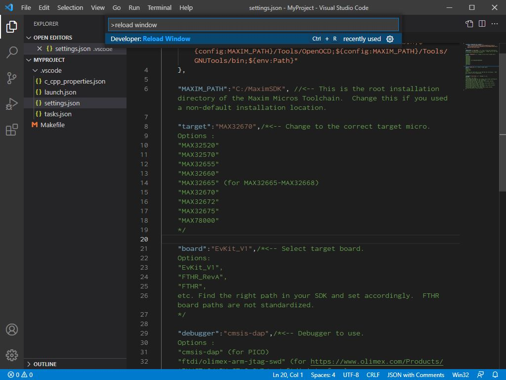

# How to Use Visual Studio Code with Maxim's Microcontrollers (Windows & Linux)

## Table of Contents
* [Introduction](#introduction)
* [De-Mystifying the SDK Toolchain](#de-mystifying-the-sdk-toolchain)
* [Integrating the Toolchain](#integrating-the-toolchain)
* [Getting Started with VSCode-Maxim](#getting-started-with-vscode-maxim)
* [Referencing Example Code](#referencing-example-code)
* [Injecting into Existing Source Code](#injecting-into-existing-source-code)
* [Creating a Project from Scratch](#creating-a-project-from-scratch)

## Introduction
IDEs targeted at microcontrollers can oftentimes come with a lot of overhead.  They have a tendency to be bulky, unwieldy programs that can take up a lot of hard drive space, and when something isn't configured properly they can be a pain to troubleshoot.  No one likes digging into project settings for hours trying to get their include paths working or troubleshooting five different configuration options just to link a library.

[Visual Studio Code](https://code.visualstudio.com/) is a lightweight, powerful, and customizable editor that can serve as a great free alternative to the more traditional micro IDEs like Eclipse, Code-Composer Studio, IAR, Keil uVision, etc.  This app note outlines step-by-step how to get started with [VSCode-Maxim](https://github.com/MaximIntegratedTechSupport/VSCode-Maxim), a development environment for Maxim's Microcontrollers targeted specifically at VS Code.  Since VSCode-Maxim makes calls directly into Maxim's toolchain, a detailed overview of it is provided to facilitate understanding and ease of use.

## De-Mystifying the SDK Toolchain
Currently, Maxim maintains two Software Development Kits (SDKs) for microcontroller development - one for our earlier Low Power (LP) microcontrollers and one for the rest of Maxim's line of Arm MCUs.  The SDK you'll use will depend on the microcontroller you're targeting, but everything is being consolidated into the [Maxim Micros SDK](https://www.maximintegrated.com/content/maximintegrated/en/design/software-description.html/swpart=SFW0010820A).  

Before digging into the VS Code setup, it will help to understand how the SDK works.  Install the SDK for your microcontroller and we'll take a look under the hood.  (If you're not sure which to use see the [readme](https://github.com/MaximIntegratedTechSupport/VSCode-Maxim/blob/main/readme.md#requirements)) 

Maxim's SDKs contain all the tools necessary to build, flash, and debug code on our Microcontrollers.  This collection of tools is called a toolchain, and it's what Integrated Development Environments (IDEs) use to build a project.  The toolchain is really just a collection of program binaries and typically includes compiler, linker, and debugger executables.  It also may include utility programs and build systems to make using these lower-level programs more convenient.

The core concepts of the content below are the same for both SDKs, but for the sake of clarity only file-paths for the MaximSDK will be used.

The main components of Maxim's SDK Toolchain are:
* [Arm GNU Compiler Collection](https://gcc.gnu.org/) (GCC) - located under `~\MaximSDK\Tools\GNUTools\bin`
* [Arm GNU Project Debugger](https://www.gnu.org/software/gdb/) (GDB) - located under `~\MaximSDK\Tools\GNUTools\bin`
* [Open On-Chip Debugger](http://openocd.org/) (OpenOCD) - located under `~\MaximSDK\Tools\OpenOCD`
* [GNU Make](https://www.gnu.org/software/make) - made available on Windows via MSYS2 and located under `~\MaximSDK\Tools\MinGW\msys\1.0\bin`

GCC is used to compile source code but is rarely called directly.  Instead, GCC is most frequently invoked in a list of directives collected into a _Makefile_.  This list of directives is called a _recipe_.  If you are new to Make, think of GCC as the hammer and Make as the builder who knows how to use it.  You can tell Make to do a task (such as "make all" the source code) and Make will follow the instructions outlined in the Makefile's recipe to complete it.

The core Makefile for a target microcontroller can be found under `~\MaximSDK\Libraries\CMSIS\Device\Maxim\<target microcontroller>\Source\GCC` - see `gcc.mk`.  This file tells Make exactly how to use GCC to compile code for that microcontroller.  All projects can then have their own Makefile that builds off of this one by `include`-ing it.

Great - so source code is compiled into firmware binaries by Make using GCC.  How is it flashed onto the microcontroller?  That's where OpenOCD comes in.  

OpenOCD handles flashing firmware and opening a debugger _server_.  It handles the necessary configuration to support the variety of debugger adapters and debugger protocols (such as SWD or JTAG) that are available and sends debugging information and instructions to the microcontroller.  OpenOCD deals with the low-level hardware and exposes a common high-level interface that can be used with a debugger _client_ such as GDB.  GDB connects to the OpenOCD server over a socket and presents a user interface.

Now that we have some understanding of the toolchain, let's see how we can integrate it into Visual Studio Code.

## Integrating the Toolchain
Visual Studio Code provides the [Tasks](https://code.visualstudio.com/Docs/editor/tasks) interface for integrating external tools.  To use the Maxim SDK toolchain via Tasks, the toolchain binaries must be made accessible from the command line.  Additionally, the correct board and peripheral driver files for a target platform must be loaded for compilation and source code development.  When those conditions are met, then Tasks can be created to conveniently implement the features that you would expect from an IDE:  building, cleaning, flashing, and debugging.

[VSCode-Maxim](https://github.com/MaximIntegratedTechSupport/VSCode-Maxim) handles this for you and offers simple, clear configuration options for changing the target platform.  It leverages the fact that VS Code loads settings from a `.vscode` folder inside its working directory.  The `.vscode` folder in the repo makes the toolchain accessible from the integrated terminal and contains the core Tasks for use with a project Makefile.  It also configures the debugger and Intellisense properly.

Let's get started setting it up.  The procedure below is a demonstration for the MAX32670EVKIT, but the same procedure can apply to all micros.

## Getting Started with VSCode-Maxim

### 1 - Install Software Requirements
First, ensure you have met the Software [Requirements](https://github.com/MaximIntegratedTechSupport/VSCode-Maxim#requirements) listed in the readme.  This includes VS Code itself, the correct SDK for your microcontroller, and the official C/C++ extension for VS Code.

If you're not sure which SDK to use for your platform, see the [readme](https://github.com/MaximIntegratedTechSupport/VSCode-Maxim/blob/main/readme.md#requirements).  

It's recommended to install all of the SDK components (Eclipse is optional) and use the default installation path.  **On Linux**:  Do not select "Eclipse".  

The C/C++ extension can be installed from within VS Code from the built-in Extensions manager by searching for `ms-vscode.cpptools`, as shown below.

### 2 - Enable Workspace Trust
Enable workspace trust following the [procedure](https://github.com/MaximIntegratedTechSupport/VSCode-Maxim#enabling-workspace-trust) in the readme.  This is necessary to load the configuration settings from VSCode-Maxim, and should be enabled by default.

### 3 - Download the Latest Release of VSCode-Maxim
The latest release can be found on Github [here](https://github.com/MaximIntegratedTechSupport/VSCode-Maxim/releases).  Extract the release to an accessible location.

You'll notice two sub-folders.  The MaximLP folder contains the configuration for the LP Microcontroller toolchain, and the MaximSDK folder contains the configurations for the MaximSDK toolchain.

### 4 - Open the Example Project
First, we'll open the example project to see how it works.  

Launch VS Code, and then select `File > Open Folder`.

Navigate to the New_Project folder for your SDK from the VSCode-Maxim release you extracted earlier.

VSCode will prompt for trust the first time.  Select _Trust folder and enable all features_.

### (Optional) Set MAXIM_PATH
If you installed the SDK to a non-default location or are using Linux you'll need to update the MAXIM_PATH variable inside of `.vscode/settings.json` to point to the right installation directory of the SDK.

Open settings.json, and edit the `MAXIM_PATH` variable to point to the root directory of the SDK.

For example, on Linux I might set `"MAXIM_PATH":"/home/jcarter/MaximSDK"`

After using CTRL+S to save the changes to settings.json, restart VS Code.  The project folder will open back up automatically and you can pick up again on step 5 - now with the toolchain accessible.

### 5 - See the Tools Working in the Terminal
VS Code should now look something like this:

If the terminal isn't open, you can launch one with `Terminal > New Terminal`.

First, we'll run through the commands in the ["Testing the Setup"](https://github.com/MaximIntegratedTechSupport/VSCode-Maxim/blob/main/readme.md#testing-the-setup) of the readme to see that the toolchain is accessible from the integrated terminal.

For example, running `make -v` in the terminal should output a version # for Make, as shown below.

Run the other commands for OpenOCD, GCC, and GDB to verify that the integrated terminal has been configured correctly from our `.vscode` folder settings.  These should all run successfully.
* `openocd -v`
* `arm-none-eabi-gcc -v`
* `arm-none-eabi-gdb -v`

### 6 - Set the Target Platform
Open `settings.json`.  This is the main configuration file for the vscode setup, and can be found inside of the `.vscode` folder.  The other configuration files (`c_cpp_properties.json`, `launch.json`, `tasks.json`) reference values set here, and it's here that we set our target platform.

Set the `"target"`, `"board"`, and `"debugger"` variables for your target platform.  See the [readme](https://github.com/MaximIntegratedTechSupport/VSCode-Maxim/blob/main/readme.md) if you're unsure what to set here.  
For example, for the MAX32670 I would set:
* `"target":"MAX32670"`
* `"board":"EvKit_V1"`
* `"debugger":"cmsis-dap"` (leaving at default)
    * The value "cmsis-dap" is used for the MAX32625PICO debugger adapter, which comes with our EVKITs and is used in the platforms with integrated debuggers such as the MAX32670EVKIT.  Unless you're using a different adapter, such as an Olimex, leave this value at its default.

Save your changes with `CTRL+S` and reload the VS Code window.  A reload is necessary after changing any options in `settings.json`. The VS Code window can be re-loaded quickly with the `Ctrl + Shift + P` -> `Reload Window` developer command.

Now VS Code is ready to edit, build, and debug source code for the target platform.

### 7 - Open the Source Code
Open `main.c`, which can be found in the `src` folder.  Here we can see the source code for a simple "Hello world" program.

    

### 8 - Clean the Program
First, let's ensure that we're starting from a clean slate.  Open the build tasks menu with `Ctrl+Shift+B` or `Terminal > Run Build Task...` and select the "clean-periph" option.  This cleans out the build products from the current project as well as the peripheral drivers in the SDK.  This ensures that the next step compiles everything from scratch.

### 9 - Build the Program
Next, we'll build the source code.  Open the build tasks menu again with `Ctrl+Shift+B` or `Terminal > Run Build Task...`

Select build to compile the source code.  You'll notice the build task completing in the terminal window, and a new `build` directory will appear in the file explorer.  At the end of a successful build the program binary (.elf file) will be placed in this build directory.

So what happened here?

When we ran the "build" task, VS Code parsed the configuration options from `settings.json` into a `make all` command that you can see on the first line of the terminal (`Executing task: ...`).  When this command is run, Make looks inside of the project `Makefile` for the "all" recipe that tells it how to build the source code.  Remember the core GCC Makefile discussed earlier?  That's where the "all" recipe is defined.  You can open the project Makefile and see exactly where it's imported with `include`.

The source code and compiler options are passed into the build with the variables further up in the Makefile.

See ["Configuring the Makefile"](https://github.com/MaximIntegratedTechSupport/VSCode-Maxim/blob/main/readme.md#configuring-the-makefile) in the readme for more details on configuring the build.

### 10 - Debug the Program
Now that we've seen the program build successfully, let's flash it onto the microcontroller and debug it.

First, open the `main.c` source file and set a breakpoint on the `int main(void)` function.  This is the entry-point into the program and ensures that the debugger will break once the program starts execution.

Next, ensure that your microcontroller is powered on and connected to your PC through your debug adapter.  On a platform with an integrated debugger, such as the MAX32670EVKIT, this is as simple as plugging it in with a micro-usb cable.  On platforms where the debug adapter is not integrated, you'll need to connect your debug adapter to the right debugger port and power the platform separately.  See your target platform's datasheet for more details.

Now, launch the debugger by pressing `F5` or by navigating to the debugger window and pressing the green play button next to "GDB".

You'll see some activity happening in the terminal as the debugger is launched. VS Code will automatically run the `build` task to make sure the code is compiled without errors.  Then, it runs the `flash` task to flash the compiled program binary to the target micro with an OpenOCD command.  Finally, it opens an OpenOCD server and launches a GDB session to connect to it.  

Once the debugger connects you should see the breakpoint set on main hit.  VS Code should look something like this:

### 11 (optional) - Open a Serial Port to the Micro
Before we continue the program execution, you'll need to open a serial port to the platform to see the "Hello world!" message and count printed.

Default serial communication settings are:
* BAUD : 115200
* Data : 8-bit
* Parity : none
* Stop bits : 1 bit
* Flow control : none

### 12 - Continue the Program
Press `F5` or hit the continue button in the debugger menu to continue the program past the breakpoint.

You should see the LED on your microcontroller blinking.  If you have a terminal window open you should also see the "Hello World" message and count being printed.

Feel free to play around in the debugger here (setting different breakpoints, watch variables, stepping into and out of functions, etc.) to get familiar.  When you're ready, you can hit the stop button to quit debugging.

### 13 - Wrapping Up
Here, we've gotten started with a basic project configuration, the available build tasks, and have debugged a Hello World program.  The `New_Project` folder is intended as a project template to get you started, and you can freely copy this project around and re-configure it for different target platforms.

You should now have a good basic understanding of how VS Code works and how Maxim's toolchain is integrated.  The next sections cover more advanced subjects.

## Referencing Example Code
When writing code for Maxim's Microcontrollers you might want to reference example code to see how to use our peripheral drivers.

In the MaximSDK examples can be found under the `~\MaximSDK\Examples\<Target Platform>` folder, and in the LP SDK they can be found under the `~\Maxim\Firmware\<Target Platform>\Applications\EvKitExamples` folder.  For instance, the MAX32670 has the following examples available:

Opening the GPIO example reveals the following contents:

There are a couple components inside the project:
* A `main.c` file with the example code
* A project `Makefile` for building the example code
* Eclipse configuration files and debugger profile (`.cproject`, `.project`, `GPIO.launch`)
* A readme

_(Before proceeding - This section assumes you've already met the [requirements](https://github.com/MaximIntegratedTechSupport/VSCode-Maxim#requirements) for using the VSCode-Maxim repository.  If not, working through the "Getting Started" section of this UG first is recommended.)_

A quick way to reference the example code is to drag and drop it into VS Code's editor while you have an active project open.  Intellisense settings for the active project will be used even when editing external files.  For example, dragging the `main.c` file from the GPIO example for the MAX32670 into the "Hello World" project we configured in the previous section allows for simultaneous viewing.

This provides a convenient way to reference the example code for your own application, and since Intellisense look-ups are loaded from our currently active project go-to definitions are supported.  For example, we can open the header file for the GPIO driver itself...

(Right click on `"gpio.h"` -> Go to Definition)

... and see that the correct header file from the peripheral drivers is opened.

If you want to dig in deeper and see how the peripheral driver functions are implemented at the register level, you can do so as well.  For example, we can look at the implementation of the `MXC_GPIO_Init` function.

The implementation file for the correct die-type of the microcontroller needs to be selected (in the case of the MAX32670 that's the ME21), and then the function definition can be viewed.  Double click on the function definition to open the full file view.

Using this method, you can quickly and easily reference example code for your own applications.  This method works for any external code, provided that the search paths for Intellisense are configured properly.  For more details on configuration of those search paths, see the [readme](https://github.com/MaximIntegratedTechSupport/VSCode-Maxim/blob/main/readme.md).

## Injecting into Existing Source Code
Using example code as a reference is great, but what if we want to work with it directly, or inject the VS Code setup into a different project that's not in the MaximSDK?  That's where the `Inject` folder in the VSCode-Maxim release package comes in.  In the example below, we'll inject the VS Code setup into the Maxim SDK GPIO example, but this procedure fundamentally applies to any existing source code.

_This section assumes you've already met the [requirements](https://github.com/MaximIntegratedTechSupport/VSCode-Maxim#requirements) for using the VSCode-Maxim repository.  If not, working through the "Getting Started" section of this UG first is recommended._

### 1 - Locate the Existing Project
Example projects can be found under the `~\MaximSDK\Examples\<Target Platform>` folder for the Maxim SDK and in the LP SDK they can be found under the `~\Maxim\Firmware\<Target Platform>\Applications\EvKitExamples` folder.  For the sake of this example, a working copy of the GPIO example has been copied over into a separate folder.

The contents of this GPIO example are as follows:

### 2 - (Optional) Delete Eclipse Project Files
The `.cproject`, `.project`, and `GPIO.launch` files are all Eclipse-related project files.  Since we're working with VS Code these can be deleted to clean up the project.

### 3 - (Optional) Rename the Existing Makefile
In step #4 we'll inject the VS Code setup into the project folder, and this will replace the existing Makefile.  It may good idea to keep the existing Makefile around for reference, especially for more complicated projects.

Rename the existing `Makefile` to `Makefile-old` to keep a reference copy.  By renaming the file, it won't interfere with our new one.

### 4 - Inject the VS Code Environment
Copy the _contents_ of the `Inject` for your SDK from VSCode-Maxim into the example project.  In this example we're working with the MAX32670, so we'll use the `Inject` folder inside of the `MaximSDK` folder.  

The contents of the project should now look something like this, with our `.vscode` folder and new `Makefile`.

### 5 - Open the Project
The GPIO is now ready to be opened from within VS Code, and from here we'll follow a similar process as the one outlined in the "Getting Started" section of this User Guide.  You'll open the project folder and configure `settings.json` for your target platform.  However, since we're injecting into existing source code, we'll need to configure the build system a bit as well.  We'll get into that, but first things first...

Launch VS Code.  Open the project folder with `File > Open Folder...` and browse to the root directory of the project.

VS Code should prompt for workspace trust.  Select _Trust folder and enable all features_.

### 6 - Set the Target Platform & Reload
Open `settings.json` inside of the `.vscode` folder and configure the project settings for your target platform.  See the [readme](https://github.com/MaximIntegratedTechSupport/VSCode-Maxim/blob/main/readme.md) if you are unsure what to set here.  
For example, settings for the MAX32670EVKIT would be...
* `"target":"MAX32670"`
* `"board":"EvKit_V1"`
* `"debugger":"cmsis-dap"`

`CTRL+S` to save the changes to the file, and then reload the VS Code window with `CTRL + SHIFT + P` > `Developer: Reload Window`.  This is necessary so that VS Code re-parses all file-paths for our new target platform.

### 7 - Configure the Build System
With the project settings configured, everything should be working in the editor.  The `main.c` file can be opened and Intellisense will work properly.

However, in order to actually build this project, we'll need to configure the build system to match the existing source code.  This involves editing the core project `Makefile`.

Open the `Makefile` in the editor.

Here, we can see a "Main Configuration" section highlighting some common options that, collectively, handle the configuration needed for most projects.  The first thing to check is that all the source files have been added to the `SRCS` variable.  The GPIO project only has a single `main.c` file, and the Makefile comes pre-configured for a `main.c` file by default.  So, we're good to go there.

However, if we look at the `VPATH` and `IPATH` options we can see some modifications are required.  `VPATH` controls where Make will look for the source files (.c) specified by the `SRCS` variable, and `IPATH` controls where it will look for header files (.h).  The GPIO example has placed the `main.c` file right in the root directory of the project but the Makefile is only configured to look inside of a `src` folder by default.  So we have two options:
1. Re-organize the existing source code to match the Makefile.
    * Create a new folder inside of the project called `src`
    * Drag `main.c` inside of that folder

    

or...

2. Re-configure the Makefile to match the existing source code.  
    * Set `VPATH` and `IPATH` to `.` to search the root directory for source and header files.

    

### 8 - Clean & Build the GPIO Example
With the Makefile configured, we're ready to build the project.

As always, with a new project it's best to run a `clean-periph` first to ensure we're starting from scratch.  

Then, run a `build` task to compile the GPIO example.  Remember - build tasks can be accessed via `Terminal > Run Build Task...` or `Ctrl+Shift+B`.

Monitor the terminal for any errors as the Makefile builds the periphal drivers and the GPIO example source code.  A successful build will look something like this, ultimately linking everything into our final `.elf` file...

... with our build products and final program binary output inside of a `build` folder.

### 9 - Wrapping Up
From here, the example is ready to be flashed to the target microcontroller, debugged, edited, and explored further.  This same process can be applied to injecting the VS Code setup into any example project or existing source code.  

To summarize, you will...
1. Copy the contents of the `Inject` folder into the root directory of the existing project (optionally renaming any existing Makefile for later reference).
2. Open the root directory of the project folder from within VS Code
3. Configure `settings.json` to match your target platform
4. Configure the Build system by editing the Makefile and/or re-organizing the source code.

## Creating a Project from Scratch
In the previous sections we've gotten started with the "Hello World" example, discussed how to reference example code, and demonstrated injecting the VS Code setup into existing source code.  Working through these examples should give you an idea of what might be involved with creating a new project from scratch, but it's helpful to have a clear procedure and example to reference.  In the example below, we'll walk through building up a simple program from scratch.  This program will have a more advanced project structure with additional source files and sub-folders.

_This section assumes you've already met the [requirements](https://github.com/MaximIntegratedTechSupport/VSCode-Maxim#requirements) for using the VSCode-Maxim repository.  If not, working through the "Getting Started" section of this UG first is recommended._

### 1 - Create the Project Folder
To start, create a new folder for the project.  The only requirements for this folder are that it's...
* Accessible
* Doesn't have any spaces in the full directory path

In this example, I've created a folder called `MyProject`.

### 2 - Inject VSCode-Maxim into the Project Folder
Next, copy the contents of the `Inject` folder for your target platform from [VSCode-Maxim](https://github.com/MaximIntegratedTechSupport/VSCode-Maxim/releases) into the newly created project folder.  If you're unsure which folder to use (`MaximLP` vs `MaximSDK`) consult the [readme](https://github.com/MaximIntegratedTechSupport/VSCode-Maxim/blob/main/readme.md).

In the example below, I'll be building a project for the MAX32670EVKIT.  So the `Inject` folder from `MaximSDK` will be used.

The contents of the new project should now look as follows...

### 3 - Open the Folder in VS Code
Launch VS Code and open the project folder with `File > Open Folder`.

VS Code should prompt for trust the first time you open the project.  Select _Trust folder and enable all features_.

### 4 - Set the Target Platform & Reload
Open `settings.json` inside of the `.vscode` folder and configure the project settings for your target platform.  See the [readme](https://github.com/MaximIntegratedTechSupport/VSCode-Maxim/blob/main/readme.md) if you are unsure what to set here.  
For example, settings for the MAX32670EVKIT would be...
* `"target":"MAX32670"`
* `"board":"EvKit_V1"`
* `"debugger":"cmsis-dap"`

`CTRL+S` to save the changes to the file, and then reload the VS Code window with `CTRL + SHIFT + P` > `Developer: Reload Window`.  This is necessary so that VS Code re-parses all file-paths for our new target platform.

### 5 - Create a 'src' Directory
Next, create a folder inside of the project called `src`.  The Makefile is pre-configured to look for source files inside of this folder by default.  It's recommended to use this configuration, but if you would like you can change the `VPATH` and `IPATH` assignments inside of the project `Makefile`.

Right click in VS Code's explorer and select "New Folder".

Name the folder "src" to match the Makefile configuration.

### 6 - Create a 'main.c' File
Next, create a `main.c` file inside of the newly created `src` folder.  This file will contain the `main` entry-point function of the program.

Right click on the `src` folder and select "New File".

Name it `main.c` and hit Enter.  It should open in the editor.

### 7 - Define a 'main' Function
Define the standard `main` function that will be the entry-point to the program.

Fundamentally, that's it.  The project is ready to be built, debugged, and expanded.  Remember:  When starting a new project, it's a good idea to run `clean-periph` once to ensure you're building the peripheral drivers from scratch.

For the sake of this example we'll continue and add in some additional source code to demonstrate additional configuration of the build system.

### 8 - Adding Additional Source Code
Adding and editing additional source code to the project is straightforward.  Files can be created from within VS Code or dragged and dropped into the project explorer.  However, the `Makefile` must be configured properly to add any additional source code to the build.

There are some general rules that can be followed for configuring the `Makefile`:
* Make sure the any implementation files added (.c) are added to the list of files to compile with the `SRCS` variable.
* Make sure the `Makefile` knows where to find these implementation files.  You control where it looks with the `VPATH` variable.
* Header files (.h) don't need to be explicitly added to the build like source files (.c) do, but the `Makefile` needs to know where to look for them.  You control where it looks with the `IPATH` variable.

For example, let's say I add the following source code in its own folder called `mylibrary`, with a `hellolibrary` header (.h) and implementation (.c) file.

All this library does is contain a function called `myfunction` that prints a string to the console.  Our main file can `#include` the header file and call `myfunction()`, which will print "Hello function!" to the console.

For this source code, we'll then modify the `Makefile` to add it to the build as follows:
* `SRCS += hellolibrary.c` to add the implementation file to the build
* `VPATH += ./src/mylibrary` so the `Makefile` knows where to find the implementation file
* `VPATH += ./src/mylibrary` so the `Makefile` knows where to find the header file.

Now, when we run the `Build` task we can see the hellolibrary.c file added to the build successfully and compiled.  The program is ready to be flashed to the microcontroller and debugged, where it will print "Hello function!" once to the serial port before exiting.

### 9 - Wrapping Up
Above, we've seen how to build up a project from scratch and how to expand it with additional source code.  The procedure outlined here for configuring the Makefile will be suitable for most situations but hasn't covered everything.  For a more detailed list of configuration options, see the [readme](https://github.com/MaximIntegratedTechSupport/VSCode-Maxim/blob/main/readme.md).

## Conclusion
Visual Studio Code is a great free code editor that, with the help of [VSCode-Maxim](https://github.com/MaximIntegratedTechSupport/VSCode-Maxim), can be used for embedded development with Maxim's Microcontroller toolchain.  Having worked through this User Guide, you now hopefully have a good understanding of how Maxim's toolchain works, how it's integrated into VS Code, and how to leverage it to develop your own projects.

Bug reports, feature requests, and contributions are welcome via the [issues](https://github.com/MaximIntegratedTechSupport/VSCode-Maxim/issues) tracker on Github.
